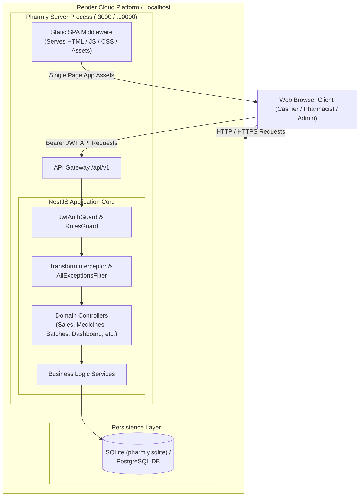
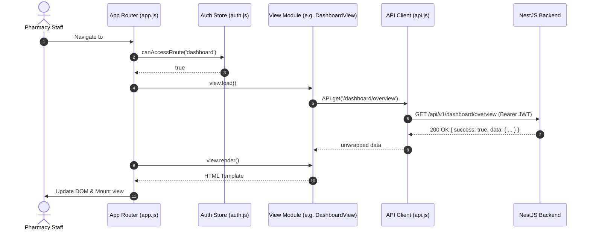
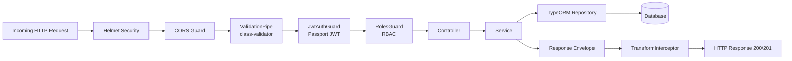
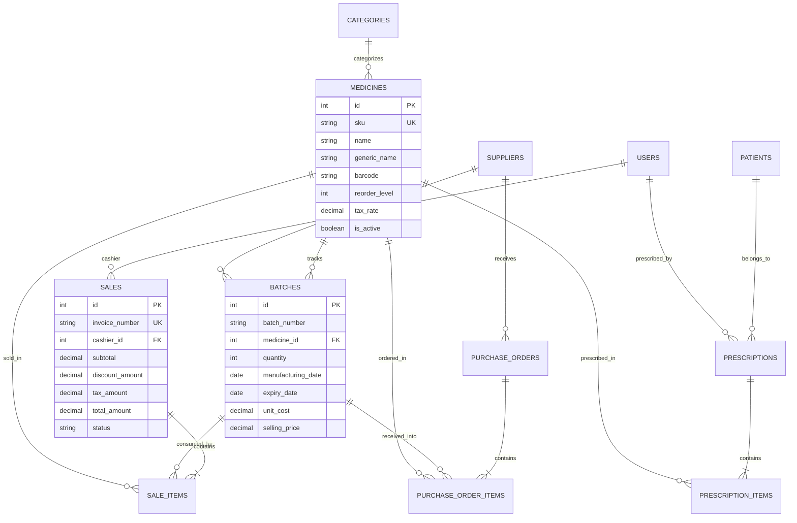
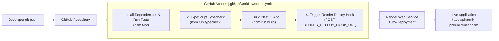

# Pharmly Pharmacy Management System — Architecture & Design Document

## 1. System Overview

**Pharmly** is a high-performance, full-stack pharmacy management system designed to handle retail pharmacy operations, inventory tracking with batch-level granularity, point-of-sale (POS) checkout using **FEFO (First-Expiry-First-Out)** stock deduction, prescription safety checking, supplier management, and executive analytics.

The application uses a **unified single-origin architecture**: the backend NestJS service directly serves both the REST API (`/api/v1`) and the static Single Page Application (SPA), eliminating CORS overhead and simplifying deployments.



---

## 2. Frontend Architecture

The frontend is built as a lightweight, zero-dependency **Vanilla JavaScript Single Page Application (SPA)** designed for high speed and minimal asset load times.

### 2.1 Component Structure & Lifecycle
- **App Shell (`frontend/js/app.js`)**: Coordinates the client lifecycle, hash-based client routing, role-based navigation bar filtering, modal lifecycle, and global keyboard shortcuts (e.g. `/` for instant catalog search, `Escape` to close modals).
- **HTTP Client (`frontend/js/api.js`)**: Wrapper around native `fetch` that automatically injects JWT Bearer tokens, unwraps API response envelopes (`{ success, data }`), and performs single-flight silent token refreshing upon encountering HTTP 401.
- **Authentication Store (`frontend/js/auth.js`)**: Manages session state in `sessionStorage` and `localStorage`, role decoding, and route permission evaluation.
- **View Modules (`frontend/js/views/`)**: Modular view objects adhering to a unified lifecycle contract:
  - `load()`: Asynchronously fetches required datasets via the `API` client.
  - `render()`: Returns deterministic HTML string templates.
  - `mount()`: Binds post-render DOM event listeners, forms, and charts.



### 2.2 Views Registry
- `DashboardView`: Real-time KPI tiles, revenue trends, expiring batch alerts, low stock alerts, and recent sales.
- `PosView`: Cashier checkout with barcode scanning, batch preview, discount calculations with manager override threshold, and receipt generation.
- `StockAlertsView`: Reorder point monitoring, out-of-stock flags, and batch risk analysis.
- `InventoryView`: Product catalog management with SKU generation and category filtering.
- `BatchesView`: Batch ingestion, expiry date management, and quantity adjustments.
- `PurchasesView`: Purchase Order lifecycle management (Draft -> Ordered -> Partially Received -> Received).
- `PrescriptionsView`: Clinical prescription dispensing with automated allergen cross-checks.
- `SalesView`: Historical invoice ledger and refund management.
- `SuppliersView`: Vendor directory and supplied medicines tracking.
- `UsersView`: Staff account administration and role assignments.

---

## 3. Backend Architecture

The backend is built with **NestJS**, structured in modular domain boundaries with strict separation of concerns:



### 3.1 Modular Organization
- **`DashboardModule`**: Aggregates KPIs, sales velocity, expiring batches, and global search across products and invoices.
- **`SalesModule`**: Handles POS checkouts, sequential invoice number generation, refunds, and FEFO inventory deduction inside atomic database transactions.
- **`MedicinesModule`**: Product catalog, stock classification (`in_stock`, `low_stock`, `out_of_stock`), and search.
- **`BatchesModule`**: Manages deliveries, unit costs, selling prices, batch numbers, and expiry windows.
- **`PurchasesModule`**: Manages vendor purchasing cycles, receiving items, and auto-creating inventory batches upon receipt.
- **`PrescriptionsModule`**: Clinical prescription recording and allergy conflict engine.
- **`AuthModule`**: Passport JWT authentication, token issuance, refresh rotation, and password hashing using bcrypt.
- **`UsersModule`**: User management with role assignments (`admin`, `pharmacist`, `cashier`).

### 3.2 Key Pipeline Components
- **`TransformInterceptor`**: Enforces consistent response envelope format:
  ```json
  { "success": true, "statusCode": 200, "data": { ... }, "timestamp": "ISO8601" }
  ```
- **`AllExceptionsFilter`**: Catches all unhandled exceptions and formats error payloads:
  ```json
  { "success": false, "statusCode": 500, "error": "...", "message": "...", "path": "...", "timestamp": "ISO8601" }
  ```
- **`ValidationPipe`**: Rejects invalid request payloads, strips non-whitelisted attributes, and casts primitives to typed DTO instances.

---

## 4. Database & Entity Relationship Model

The system uses **TypeORM** supporting both **SQLite** (local / embedded development) and **PostgreSQL** (production enterprise).



---

## 5. Core Business Workflows

### 5.1 Point-of-Sale (POS) & FEFO Stock Consumption
During checkout:
1. Lines with identical medicines are merged to maintain accurate demand counters.
2. The transaction acquires pessimistic write locks on active batches (`quantity > 0`).
3. Batches are sorted in **First-Expiry-First-Out (FEFO)** order:
   $$\text{Order: } \text{expiry\_date ASC}, \text{id ASC}$$
4. Stock is deducted consecutively from the earliest-expiring batches until requested quantity is fulfilled.
5. If total stock across all active batches is insufficient, the transaction throws `BadRequestException` and aborts.
6. A sequential invoice number is minted (`INV-YYYYMMDD-XXXX`).

### 5.2 Allergy Cross-Check Engine
When a clinical prescription is issued:
1. Patient's `knownAllergies` are extracted and tokenized.
2. The prescription items' drug names and active ingredients are compared against known allergies using fuzzy and normalized string matching.
3. If an allergy conflict is identified:
   - Prescription is flagged with `allergy_warning_triggered = true`.
   - Dispensing is blocked unless authorized staff submits an explicit override reason logged in `allergy_override_reason` and `allergy_override_by`.

---

## 6. Security Architecture

1. **Token Authentication**: Stateless Bearer JWT tokens with short TTL (8h), coupled with securely stored refresh tokens (7d).
2. **Role-Based Access Control (RBAC)**:
   - **`admin`**: Full access to financial reports, user provisioning, system configurations, and voids.
   - **`pharmacist`**: Catalog modifications, batch adjustments, supplier management, and purchase order fulfillment.
   - **`cashier`**: POS checkouts, receipt reprints, and read-only catalog browsing.
3. **Password Security**: Bcrypt salted hashes with configurable cost factor (`BCRYPT_SALT_ROUNDS=10`).
4. **Defensive Headers**: `helmet` security middleware protection for CSP, X-Frame-Options, and X-Content-Type-Options.

---

## 7. CI/CD & Deployment Architecture (Render)

The project includes automated continuous integration and continuous deployment configured for **Render**:



### 7.1 Deployment Files
- **`render.yaml`**: Infrastructure-as-code blueprint defining the web service, build and start commands, health check route (`/api/v1/health`), and environment variable templates.
- **`.github/workflows/ci-cd.yml`**: Automates linting, testing, and production builds on every push/PR, and triggers Render deployment upon merging into `main`.
- **`Dockerfile`**: Multi-stage production container image bundling Node.js runtime, compiled server, database, and static frontend assets.
- **`package.json`**: Root orchestration scripts enabling seamless `npm run build`, `npm run start`, and `npm test` from the workspace root.
